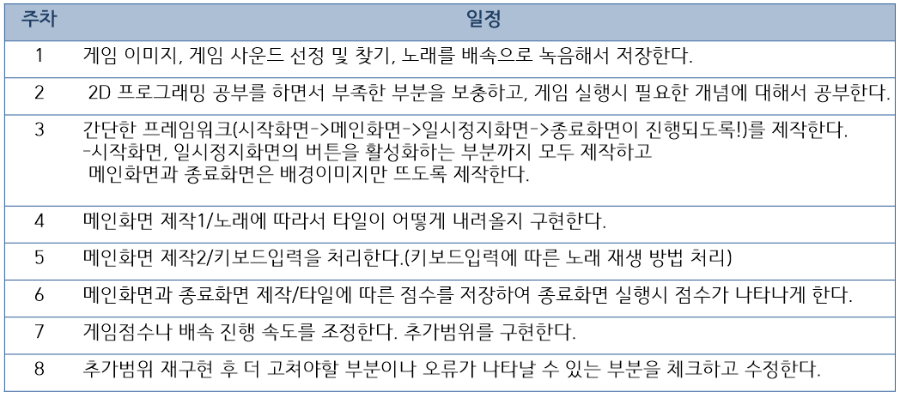

2D 프로그래밍 기말 프로젝트 : 피아노 타일
============================
1.게임의 소개 - 피아노 타일
---------------

	피아노 타일이라는 게임은 학창시절 누구나 즐겼던 스마트폰 리듬게임 입니다.
	곡을 재생하면 피아노 타일모양이 아래로 떨어지고 피아노 타일을 순서대로 터치하면 됩니다.
	완곡 횟수에 따라 노래가 배속이 되면서 타일이 떨어지는 속도 또한 빨라지기 때문에 타일을 놓치면 게임이 끝나게 됩니다.
	타일을 누를 때 마다 점수가 쌓이기 때문에 누가 더 높은 점수를 받았는지로 플레이어 간의 승패를 따집니다.
	스마트폰 게임이기에 터치 대신에 키보드 입력을 받아서 진행하도록 할 것이며,
	게임이 끝날 때 마다 점수를 저장하여 비교해 볼 수 있도록 만들 것 입니다.

2.GameState (Scene) 의 수 및 각각의 이름
--------------------------------------------------
	시작화면,게임화면,일시정지화면,게임결과화면의 총 4개의 씬으로 구성되어 있습니다.
	

3.각 GameState 별 다음 항목
--------------------------------
	-시작화면
	게임을 시작하는 타이틀 화면을 띄웁니다.
	enter키 입력 또는 start 버튼 클릭:게임 플레이 화면으로 넘어갑니다.
	esc키 입력 또는 end 버튼 클릭: 종료합니다.
 
	-게임화면
	게임을 플레이합니다.
	1.시작화면에서 플레이버튼을 누르면 아래 화면이 뜨면서 시작에 해당하는 키를 누르면 게임이 시작됩니다.	
	2.위에서 아래로 떨어지는 타일의 순서대로 해당하는 키를 누릅니다.
	3.동그라미 표시가 된 타일은 계속 누르고 있어야하며 이 타일을 통한 추가 점수가 타일 위에 표시됩니다.
	4.타일을 누를때마다 노래가 재생되며 다른키를 눌렀을 때 빨간색으로 타일이 뜨며 게임을 끝내게 됩니다.
	일시정지:p키를 누르면 일시정지화면으로 넘어갑니다.

	-일시정지화면
	키보드 입력을 받지 않는 게임 정지상태입니다. 게임 데이터는 계속 저장되어 있습니다.
	play:게임을 계속 진행합니다.
	quit:시작화면으로 돌아갑니다. 이전 게임의 데이터는 초기화합니다.

	-게임결과화면
	본인이 획득한 점수와 이전에 기록한 점수를 보여줍니다.
	replay:게임 데이터를 초기화 한 후 시작화면으로 돌아갑니다.
	exit:게임을 종료합니다.
	

[입력에 따른 상태 변경]

4.개발 범위
-----------

*교수님의 의견을 참고하여서 입력 최소범위는 DFJK키로 설정하고 추가 범위는 ASDF,DFJK,DFGH,JKL; 네가지 종류로 설정하여 게임을 진행할 수 있도록 하겠습니다.

5.개발 일정
-----------

4.필요한 기술
-------------
	-다른 과목에서 배운 기술
	윈도우 프로그래밍 수강 시 게임을 만들면서 배웠던 전반적인 구조들(프레임워크, 버퍼링, 그래픽 적용)을 적용할 필요가 있습니다.  

	-이 과목에서 배울 것으로 기대되는 기술
	수업시간에 배운 애니메이션 뿐만 아니라 사운드 구현,애니메이션,폰트출력부분이 이 게임을 만들 때 수업에서 배울 것으로 기대됩니다.

	-다루지 않는 것 같아서 수업에 다루어 달라고 요청할 기술
	게임에 음악을 넣는 법, 음악을 배속 진행하는 법, 노래의 주파수나 박자에 따라서 랜덤으로 타일을 생성해내는 기술을 배워보고 싶습니다.
