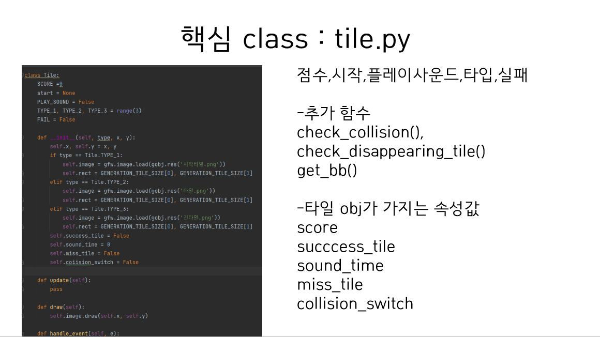
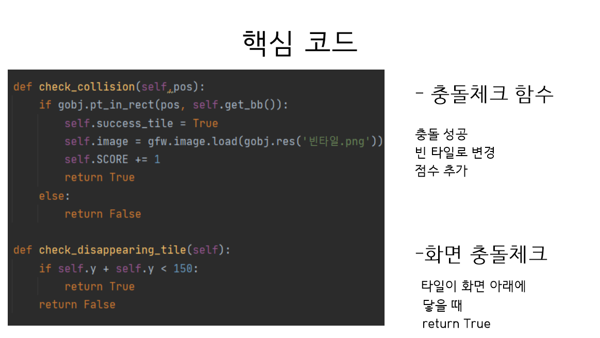
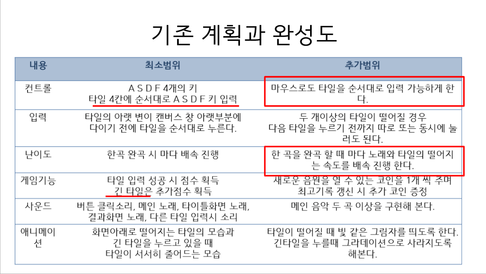

2D 프로그래밍 기말 프로젝트 : 피아노 타일
============================
1.게임의 소개 - 피아노 타일
---------------

	피아노 타일이라는 게임은 학창시절 누구나 즐겼던 스마트폰 리듬게임 입니다.
	곡을 재생하면 피아노 타일모양이 아래로 떨어지고 피아노 타일을 순서대로 터치하면 됩니다.
	완곡 횟수에 따라 노래가 배속이 되면서 타일이 떨어지는 속도 또한 빨라지기 때문에 타일을 놓치면 게임이 끝나게 됩니다.
	타일을 누를 때 마다 점수가 쌓이기 때문에 누가 더 높은 점수를 받았는지로 플레이어 간의 승패를 따집니다.
	스마트폰 게임이기에 터치 대신에 키보드 입력을 받아서 진행하도록 할 것이며,
	게임이 끝날 때 마다 점수를 저장하여 비교해 볼 수 있도록 만들 것 입니다.

2.GameState (Scene) 의 수 및 각각의 이름
--------------------------------------------------
	시작화면,게임화면,일시정지화면,게임결과화면의 총 4개의 씬으로 구성되어 있습니다.
	

3.각 GameState 별 다음 항목
--------------------------------
	-시작화면
	게임을 시작하는 타이틀 화면을 띄웁니다.
	enter키 입력 또는 start 버튼 클릭:게임 플레이 화면으로 넘어갑니다.
	esc키 입력 또는 end 버튼 클릭: 종료합니다.
 
	-게임화면
	게임을 플레이합니다.
	1.시작화면에서 플레이버튼을 누르면 아래 화면이 뜨면서 시작에 해당하는 키를 누르면 게임이 시작됩니다.	
	2.위에서 아래로 떨어지는 타일의 순서대로 해당하는 키를 누릅니다.
	3.동그라미 표시가 된 타일은 계속 누르고 있어야하며 이 타일을 통한 추가 점수가 타일 위에 표시됩니다.
	4.타일을 누를때마다 노래가 재생되며 다른키를 눌렀을 때 빨간색으로 타일이 뜨며 게임을 끝내게 됩니다.
	일시정지:p키를 누르면 일시정지화면으로 넘어갑니다.

	-일시정지화면
	키보드 입력을 받지 않는 게임 정지상태입니다. 게임 데이터는 계속 저장되어 있습니다.
	play:게임을 계속 진행합니다.
	quit:시작화면으로 돌아갑니다. 이전 게임의 데이터는 초기화합니다.

	-게임결과화면
	본인이 획득한 점수와 이전에 기록한 점수를 보여줍니다.
	replay:게임 데이터를 초기화 한 후 시작화면으로 돌아갑니다.
	exit:게임을 종료합니다.
	

[입력에 따른 상태 변경]

4.개발 범위
-----------

*교수님의 의견을 참고하여서 입력 최소범위는 DFJK키로 설정하고 추가 범위는 ASDF,DFJK,DFGH,JKL; 네가지 종류로 설정하여 게임을 진행할 수 있도록 하겠습니다.

5.개발 일정
-----------

4.필요한 기술
-------------
	-다른 과목에서 배운 기술
	윈도우 프로그래밍 수강 시 게임을 만들면서 배웠던 전반적인 구조들(프레임워크, 버퍼링, 그래픽 적용)을 적용할 필요가 있습니다.  

	-이 과목에서 배울 것으로 기대되는 기술
	수업시간에 배운 애니메이션 뿐만 아니라 사운드 구현,애니메이션,폰트출력부분이 이 게임을 만들 때 수업에서 배울 것으로 기대됩니다.

	-다루지 않는 것 같아서 수업에 다루어 달라고 요청할 기술
	게임에 음악을 넣는 법, 음악을 배속 진행하는 법, 노래의 주파수나 박자에 따라서 랜덤으로 타일을 생성해내는 기술을 배워보고 싶습니다.
	
2D 프로그래밍 기말 프로젝트 2차 리드미 : 피아노 타일
============================

1.개발진행상황
-------------

         피아노 타일이란 떨어지는 타일을 노래에 맞추어 클릭하는 게임입니다.
         현재 60~70퍼센트 완료하였고
         최고점수 기록, 완곡 후 타일 재생성, 버튼추가가 남았습니다.
         사실 구현한 '반짝반짝 작은별'이라는 노래의 박자가 긴박자가 없어서 긴타일을 넣을지 고민중이라서 이부분은 목표를 변경할 가능성이 있습니다.

         3주차에 버튼활성화 부분은과 6주차에 결과화면 최고점수 기록부분은 아직 구현하지 못했습니다.
         5주차에 키보드입력이라는 부분은 피아노 타일의 특성상 떨어지는 타일영역을 입력하는 것에 대한 몰입도와 맞지 않아 마우스입력으로 변경하였습니다.

2.git commit 내용
-----------------

         1주차에는 리소스파일 커밋 5회, 2주차에는 파이썬 공부로 목표일정을 잡았었고, 
         3~5주차는 중간고사와 과제로 커밋하지 못하였습니다. 6주차에 4회에 걸쳐 3~6주차 내용을 커밋하였습니다.

3.핵심 class : tile.py
----------------------

         핵심클래스는 타일 묘듈입니다.
         update(), draw() 등 외에 충돌체크함수를 추가하였고
         충돌체크 관련 변수, 점수, 사운드 재생과 관련된 변수가 있습니다.
         이 충돌체크 함수와 변수로 타일 충돌체크를 성공하면 음악재생시간 변수를 0으로 초기화한 후 델타타임을 더하여 일정시간이 
         흐르면 자동으로 노래가 꺼지게 구현하였습니다.
	 실제 음악을 재생할때에는 노래가 계속 재생되는 것 처럼 보이지만 일시정지 버튼을 눌렀을 때 음악이 바로 꺼지는 것이아니라 얼마 후에 꺼지는 모습을 보면서
	 타일을 누를 때마다 일정시간동안 노래가 재생되었다가 자동으로 꺼짐을 알 수 있습니다. 즉 타일을 누를때마다 노래가 재생되는 것입니다.
	 피아노타일에서의 음악 재생 특성을 그대로 데모한 것입니다.

          마우스 입력에 따라서 타일상태를 변경합니다.

          check_collision()은 충돌성공시 빈타일로 변경하고 점수를 추가하는 충돌체크함수입니다. 
          check_dissapearing_tile()은 화면아래와 충돌여부를 체크하는 함수입니다.

          메인스테이트에서 충돌체크함수와 변수로 타일 상태를 놓친타일로 변경하는 코드입니다.

4.어려웠던 부분과 수업시간에 배우고싶은 부분
----------------------------------------
          타일은 마우스 입력에 따라 상태가 변하기에 여러개의 성공한타일과 놓친타일들 중 어딘가쯤에 
	  새로 성공한 타일을 핸들이벤트안에서 동시에 체크하는 부분이 어려웠습니다.
	  그래서 이부분은 아직 구현중입니다.

          타일을 생성할 때 txt파일로 타일맵을 생성하였는데 같은 파일로 반복 생성할 때에는 
	  어떻게 해야 할지가 어려워서 수업시간에 추가적으로 다뤘으면 좋겠습니다.
	  
2D 프로그래밍 기말 프로젝트 최종 리드미 : 피아노 타일
============================

1.개발척도
------------------------

          최소범위 중 키 입력은 피아노타일만의 리듬감을 살리기위해 추가범위로 변경하였습니다
	  난이도부분은 추가범위까지 구현완료 하였고 게임 기능 중 긴타일 부분은 짧은 리듬이 반복되는 노래
	  특성상 제외하였습니다. 이 외에는 모두 구현하였습니다.
	  

2.git commit 내용
------------------

          1주차-리소스 파일 커밋 5회
          2주차-(원래 파이썬 공부가 계획이었습니다.)
          6주차-1회:3~4주차 커밋
		2회:5주차 커밋
		3회:5,7주차 커밋
	        4회:6주차 커밋

          7주차- 2차발표 제출(10회)
	  8주차- 1회커밋
	  9주차- 최종본 1회커밋
	  
	  
3.메뉴-메인-결과화면
---------------------

          메인화면에서 버튼에 마우스를 대면 플레이할 노래를 들을 수 있고
	  때면 노래가 멈춥니다. 다시 대면 다시 플레이됩니다.
	  플레이버튼을 누르면 메인화면으로 전환합니다.
	  최고점수를 알수있고, 시작타일을 누르면 시작합니다.
	  타일을 누를때마다 빈타일로 바뀌고 타일을 놓칠 시 빨간타일로 바뀌어서 게임이 종료됩니다.
	  p버튼을 누르면 일시정지, s를 누르면 다시 시작합니다.
	  타일 1 개당 1점씩 점수를 얻고, 최고기록 갱신시 최고기록에 현재 점수가 뜨게 됩니다.
	  다시하기 버튼을 누르면 메뉴화면으로 돌아가 게임을 다시 시작할수 있고,
	  나가기 버튼을 누르면 종료합니다.

	  

